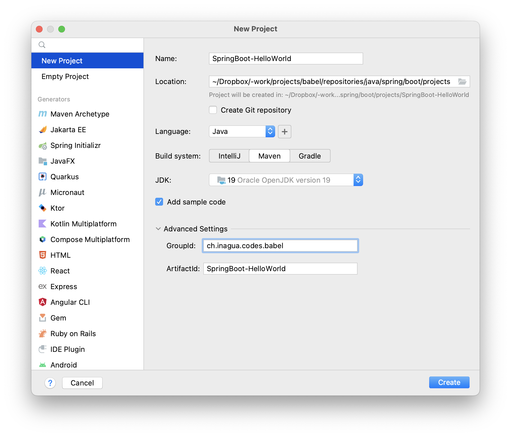

# Spring Boot

- Part of [Java](../..) / [Spring](..)
- [spring.io/projects/spring-boot](https://spring.io/projects/spring-boot) `#2.7.4`

## Project
- [SpringBoot-HelloWorld](./projects/SpringBoot-HelloWorld)



## Concepts
- Easily develop autonomous apps
- Tomcat embedded
- Use [Spring](..)


## Dependencies
- [Maven](../../maven) as build and dependencies management tool


## Concepts

### Inversion Of Control (IoC)
- Uncouple the execution of a task from its definition
- Separate the **WHAT** from the **WHEN**


### Dependency Injection (DI)
- A way of doing IoC
- By injecting its dependencies to an object
- Different means:
  - Setters
  - Constructors
  - Interfaces
  - Field Based
- SpringBoot uses `@Autowired` annotation to inject dependencies


## Spring Beans
- Customized user objects managed by the IoC container
- `@Component` used on a class to declare it to the IoC container: the class becomes a managed bean
- `@Bean` used on a method to defined its result as a bean, only on classes using `@Configuration`
- By default, the bean name is the same as the method
- `@Autowired` allows to inject beans through constructors, setters or fields
  - Matching by the type (default)
  - Matching by the field name
  - Matching with additional annotations (`@Qualifier`)
- 6 scopes
  - Singleton (by default): only a single instance in a same application context
  - Prototype: a new instance each time a bean is asked to the container
  - Web: Request, Session, Global Session and Application (ServletContext)

### Lifecycle
Creation:
1. constructor
1. Setter
1. `@PostConstruct`
1. `afterPropertySet()` (from `InitializableBean`)
Destroy:
1. `@Predestroy`
1. `Destroy()` (from `DisposableBean`)
1. `finalize()`
```java
import org.springframework.beans.factory.DisposableBean;
import org.springframework.beans.factory.InitializingBean;
import org.springframework.stereotype.Component;
import javax.annotation.PostConstruct;
import javax.annotation.PreDestroy;

public class SFriendlyGreetings extends SGreetingsBase implements InitializingBean, DisposableBean {
  @Override
  public String greet() {
    return "Dear Jack! " + this.count++;
  }


  @Override
  public void destroy() throws Exception {
    System.out.println(">> Destroy");
  }

  @Override
  public void afterPropertiesSet() throws Exception {
    System.out.println(">> After property set");
  }

  @PostConstruct
  public void myPostConstruct() {
    System.out.println(">> @PostConstruct");
  }
  @PreDestroy
  public void myPreDestroy() {
    System.out.println(">> @PreDestroy");
  }

}
```
Logs:
```shell
>> @PostConstruct
>> After property set
>> @PreDestroy
>> Destroy
```


## Properties files
- To set properties
- Toe externalize configuration data from code

- spring/boot/projects/SpringBoot-HelloWorld/src/main/resources/application.yaml:
```yaml
database:
  url: url-to-database
  username: database-username
```

spring/boot/projects/SpringBoot-HelloWorld/src/main/java/ch/inagua/codes/babel/configuration/CCDatabaseConfiguration.java
```java
package ch.inagua.codes.babel.configuration;

import org.springframework.boot.context.properties.ConfigurationProperties;
import org.springframework.stereotype.Component;

@Component
@ConfigurationProperties(prefix = "database")
public class CCDatabaseConfiguration {

    private String url;
    private String username;

    public String getUrl() {
        return url;
    }

    public void setUrl(String url) {
        this.url = url;
    }

    public String getUsername() {
        return username;
    }

    public void setUsername(String username) {
        this.username = username;
    }
}
```


## Code

### Application
```java
package ch.inagua.codes.babel;

import org.springframework.boot.SpringApplication;
import org.springframework.boot.autoconfigure.SpringBootApplication;

@SpringBootApplication
public class Main {
    public static void main(String[] args) {
        SpringApplication.run(Main.class);
    }
}
```

### Controller / route
```java
package ch.inagua.codes.babel;

import org.springframework.web.bind.annotation.RequestMapping;
import org.springframework.web.bind.annotation.RestController;

@RestController
public class HelloWorldController {
    @RequestMapping("/hello")
    public String getHello() {
        return "HiJack";
    }
}
```

### Dependency Injection
```java
package ch.inagua.codes.babel;

import org.springframework.web.bind.annotation.RequestMapping;
import org.springframework.web.bind.annotation.RestController;

public interface GreetingsInterface {
  String greet();
}

@Component
public class Greetings implements GreetingsInterface {
  public String greet() {
    return "HiJack!";
  }
}

@Component
public class FriendlyGreetings implements GreetingsInterface {
  @Override
  public String greet() {
    return "Dear Jack!";
  }
}

@RestController
public class HelloWorldController {
  @Autowired
  Greetings greetings;                  // Matching the type => Greetings

  @Autowired
  GreetingsInterface greetings;         // Matching the name of the field => Greetings

  @Autowired
  GreetingsInterface friendlyGreetings; // Matching the name of the field => FriendlyGreetings

  @Autowired
  // @Qualifier(value="friendlyGreetings")
  GreetingsInterface greetings666;      // Fail!
                                        // Or use @Component(value=greetings666) in the target class definition
                                        // Or use @Qualifier(value="friendlyGreetings") here / above
  @RequestMapping("/hello")
  public String getHello() {
    return this.greetings.greet();
  }
}
```
